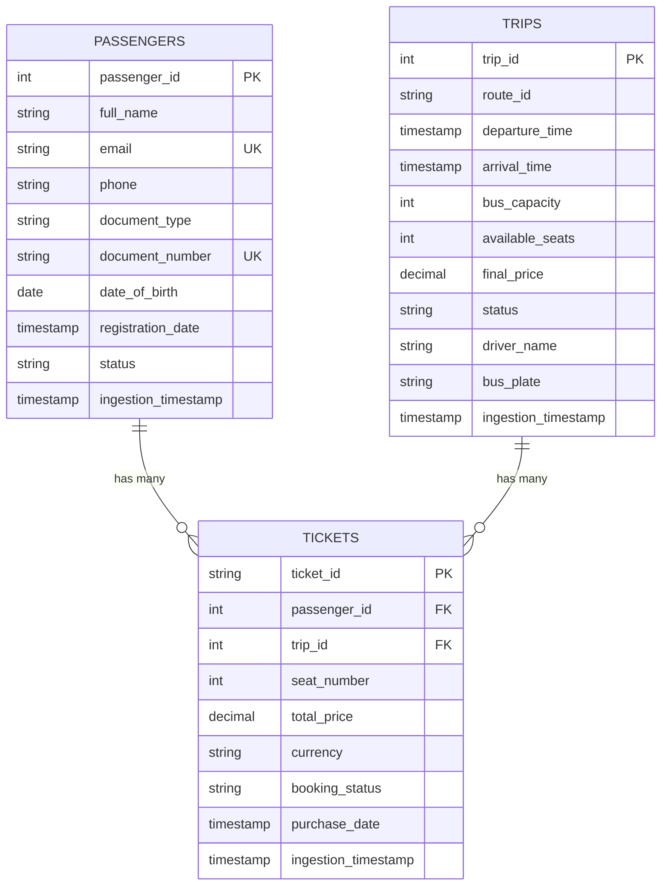

# Diagrama ER - Instrucciones de Generación

## Opción 1: dbdiagram.io (RECOMENDADO)

### Pasos:
1. Ir a https://dbdiagram.io/
2. Abrir archivo: `er_diagram_dbdiagram.txt`
3. Copiar todo el contenido
4. Pegar en el editor de dbdiagram.io
5. El diagrama se generará automáticamente
6. Exportar como PNG o PDF:
   - Click en "Export" en la esquina superior derecha
   - Seleccionar "Export to PNG" o "Export to PDF"

### Características:
- ✅ Genera diagrama profesional automáticamente
- ✅ Muestra relaciones con flechas
- ✅ Incluye tipos de datos
- ✅ Muestra índices
- ✅ Exportación de alta calidad

---

## Opción 2: Draw.io (Diagrama Personalizado)

### Pasos:
1. Ir a https://app.diagrams.net/
2. Crear nuevo diagrama
3. Usar componentes de "Entity Relation"
4. Dibujar las 3 tablas con sus campos
5. Conectar con relaciones 1:N

### Template ASCII para referencia:
```
┌──────────────────────────────────────┐
│           PASSENGERS                 │
├──────────────────────────────────────┤
│ 🔑 passenger_id        INT    PK     │
│    full_name           VARCHAR       │
│    email               VARCHAR  UQ   │
│    phone               VARCHAR       │
│    document_type       VARCHAR       │
│    document_number     VARCHAR  UQ   │
│    date_of_birth       DATE          │
│    registration_date   TIMESTAMP     │
│    status              VARCHAR       │
│    ingestion_timestamp TIMESTAMP     │
└──────────────────────────────────────┘
                  │
                  │ 1
                  │
                  │ has many
                  │
                  │ N
      ┌───────────┴───────────┐
      │                       │
┌─────▼───────────────────────────────┐
│             TICKETS                 │
├─────────────────────────────────────┤
│ 🔑 ticket_id          VARCHAR  PK   │
│ 🔗 passenger_id       INT      FK   │──┐
│ 🔗 trip_id            INT      FK   │──┼──┐
│    seat_number        INT           │  │  │
│    total_price        DECIMAL       │  │  │
│    currency           VARCHAR       │  │  │
│    booking_status     VARCHAR       │  │  │
│    purchase_date      TIMESTAMP     │  │  │
│    ingestion_timestamp TIMESTAMP    │  │  │
└─────────────────────────────────────┘  │  │
                                         │  │
      belongs to ┌────────────────────────┘  │
                 │                           │
      ┌──────────┘                           │
      │                                      │
      │ N                                    │ N
      │                                      │
      │ has many                   belongs to│
      │                                      │
      │ 1                                    │ 1
┌─────▼──────────────────────────────────────▼──┐
│           PASSENGERS    │        TRIPS        │
│      (ver arriba)       │                     │
└─────────────────────────┴─────────────────────┘

┌─────────────────────────────────────┐
│               TRIPS                 │
├─────────────────────────────────────┤
│ 🔑 trip_id            INT      PK   │
│    route_id           VARCHAR       │
│    departure_time     TIMESTAMP     │
│    arrival_time       TIMESTAMP     │
│    bus_capacity       INT           │
│    available_seats    INT           │
│    final_price        DECIMAL       │
│    status             VARCHAR       │
│    driver_name        VARCHAR       │
│    bus_plate          VARCHAR       │
│    ingestion_timestamp TIMESTAMP    │
└─────────────────────────────────────┘
```

---

## Opción 3: MySQL Workbench (Para usuarios avanzados)

### Pasos:
1. Abrir MySQL Workbench
2. File → New Model
3. Add Diagram
4. Agregar 3 tablas
5. Definir relaciones
6. File → Export → Export as PNG

---

## Opción 4: Mermaid (Markdown Diagram)

Pegar este código en GitHub o en https://mermaid.live/



---

## Elementos que DEBE incluir el Diagrama

### ✅ Checklist del Diagrama:

- [ ] **3 Entidades**:
  - [ ] PASSENGERS
  - [ ] TRIPS
  - [ ] TICKETS

- [ ] **Claves Primarias** (marcadas con 🔑 o PK):
  - [ ] passenger_id en PASSENGERS
  - [ ] trip_id en TRIPS
  - [ ] ticket_id en TICKETS

- [ ] **Claves Foráneas** (marcadas con 🔗 o FK):
  - [ ] passenger_id en TICKETS
  - [ ] trip_id en TICKETS

- [ ] **Relaciones**:
  - [ ] PASSENGERS → TICKETS (1:N)
  - [ ] TRIPS → TICKETS (1:N)
  - [ ] Indicar cardinalidad (1, N, o 1..*)

- [ ] **Campos principales** de cada tabla

- [ ] **Tipos de datos** (al menos para PKs y FKs)

---

## Recomendación

Para una entrega profesional, usa **dbdiagram.io** porque:
- ✅ Es rápido (menos de 2 minutos)
- ✅ Genera diagramas profesionales
- ✅ Exporta en alta calidad
- ✅ Es gratuito
- ✅ No requiere instalación

---

## Ejemplos de Diagramas Generados

Puedes buscar en Google Images:
- "entity relationship diagram example"
- "mysql er diagram"
- "database schema diagram"

Para tener referencia visual de cómo debe verse.

---

## Tamaño y Formato Recomendado

- **Formato**: PNG o PDF
- **Resolución**: Mínimo 1200x800 px
- **Orientación**: Horizontal (landscape)
- **Calidad**: Texto legible al hacer zoom
- **Colores**: Colores profesionales (evitar colores muy brillantes)

---

## Dónde Guardar el Diagrama

```
docs/
└── analytics/
    ├── data_catalog_er.md          (Descripción textual)
    ├── er_diagram.png              (Diagrama visual) ← CREAR ESTE
    └── er_diagram_dbdiagram.txt    (Código fuente)
```

---

## Verificación Final

Antes de entregar, verifica que el diagrama muestre:
1. ✅ Las 3 tablas claramente identificadas
2. ✅ Líneas de relación conectando TICKETS con PASSENGERS y TRIPS
3. ✅ Cardinalidades (1 y N) en ambos extremos de cada relación
4. ✅ Claves primarias marcadas o resaltadas
5. ✅ Claves foráneas identificadas
6. ✅ Nombres de campos legibles
7. ✅ Leyenda o notas explicativas (opcional)

---

**¡Listo para generar tu diagrama profesional!** 🎨
